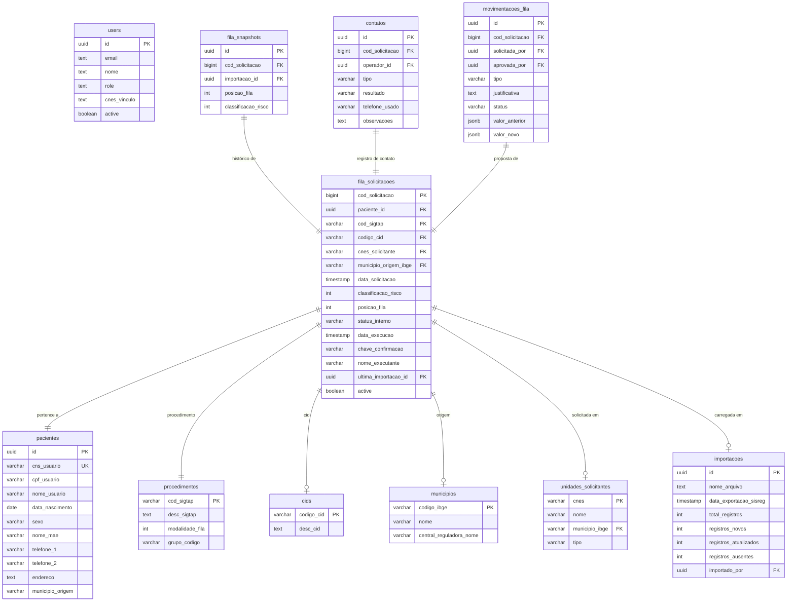
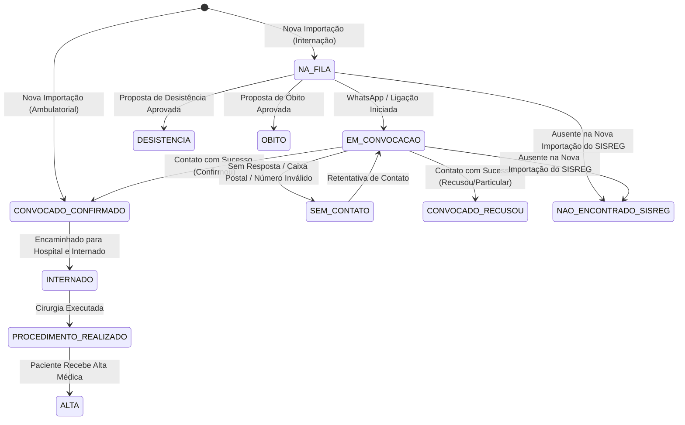

# 🏗️ Arquitetura de Fluxos e Dados — SisFilaSus

Este documento detalha o design técnico, modelagem do banco de dados, ciclo de vida das solicitações e as regras de automação (triggers) adotadas no **SisFilaSus**.

---

## 📊 1. Modelagem do Banco de Dados (PostgreSQL)

O banco de dados está isolado e estruturado nas seguintes tabelas principais:

---

## 🔄 2. Ciclo de Vida do Status Interno (`status_interno`)

A coluna `status_interno` controla o fluxo operacional de cada solicitação. As transições ocorrem de acordo com as ações dos operadores ou triggers automáticos do banco:

### 📋 Detalhamento dos Status:
* **`NA_FILA`**: O paciente está aguardando passivamente na fila oficial do SISREG.
* **`EM_CONVOCACAO`**: O operador iniciou o processo de convocação ativa (chama no WhatsApp).
* **`CONVOCADO_CONFIRMADO`**: Paciente contactado. Confirmou que deseja o procedimento e aguarda agendamento/internação.
* **`CONVOCADO_RECUSOU`**: Paciente contactado. Informou que já realizou de forma particular, por plano de saúde ou desistiu do procedimento.
* **`SEM_CONTATO`**: Tentativas falhas de contato (não atende, caixa postal ou número inexistente).
* **`INTERNADO`**: Paciente internado em hospital prestador aguardando a cirurgia.
* **`PROCEDIMENTO_REALIZADO`**: Cirurgia ou exame concluído.
* **`ALTA`**: Paciente recuperado e liberado.
* **`DESISTENCIA` / `OBITO` / `TRANSFERENCIA`**: Status terminais aplicados via workflow de movimentação.
* **`NAO_ENCONTRADO_SISREG` (Fora do SISREG)**: Solicitação ausente na exportação do SISREG (provavelmente concluída na Central do Estado ou cancelada).

---

## ⚡ 3. Automações e Triggers no PostgreSQL

O banco de dados utiliza triggers para manter a integridade, rastreabilidade e histórico dos dados:

### 1. Triggers de Auditoria (`process_audit_log`)
Gatilho aplicado nas tabelas `pacientes`, `fila_solicitacoes`, `contatos` e `movimentacoes_fila`.
* **Ação**: A cada `INSERT`, `UPDATE` ou `DELETE`, intercepta os dados e registra uma linha imutável na tabela `public.audit_log` contendo:
  * O nome da tabela e o ID do registro alterado.
  * A ação executada (`INSERT`, `UPDATE` or `DELETE`).
  * O UUID do usuário logado no Supabase (`auth.uid()`).
  * O snapshot em formato JSONB de como os dados estavam antes (`dados_anteriores`) e como ficaram após a alteração (`dados_novos`).

### 2. Trigger de Aplicação de Movimentações (`apply_fila_movement`)
Gatilho aplicado na tabela `movimentacoes_fila` executado `AFTER UPDATE`.
* **Ação**: Quando o status da proposta transita de `PENDENTE` para `APROVADO`, atualiza automaticamente na tabela `fila_solicitacoes`:
  * A nova `classificacao_risco` (se informada).
  * A nova `posicao_fila` (se informada).
  * O `status_interno` (se o tipo de proposta for `DESISTENCIA` ➔ status `DESISTENCIA`, ou `OBITO` ➔ status `OBITO`).

---

## 📥 4. Motor de Importação e Tratamento de Ausentes (Fora do SISREG)
O algoritmo de importação realiza as seguintes etapas lógicas para garantir performance com arquivos grandes:
1. **Sanitização de Cabeçalhos**: Renomeia colunas repetidas (adicionando sufixos `_1`, `_2`) para evitar colisões (típico nos relatórios ambulatoriais do SISREG).
2. **Importação Relacional em Cascata**: Realiza o upsert de tabelas de apoio primeiro (CIDs, procedimentos, unidades, municípios) para manter as foreign keys válidas antes de inserir os pacientes e as solicitações.
3. **Mapeamento e Identificação de Ausentes**:
   * O sistema obtém as especialidades (procedimentos) que estão sendo importadas neste lote.
   * Executa uma única query no Postgres buscando solicitações ativas daquelas mesmas especialidades que **não constam** no novo arquivo.
   * Atualiza o status dessas solicitações antigas para `NAO_ENCONTRADO_SISREG` e define `active = true` (ou inativa dependendo das regras). Isso economiza largura de banda e tempo de processamento comparado a loops em JavaScript.
