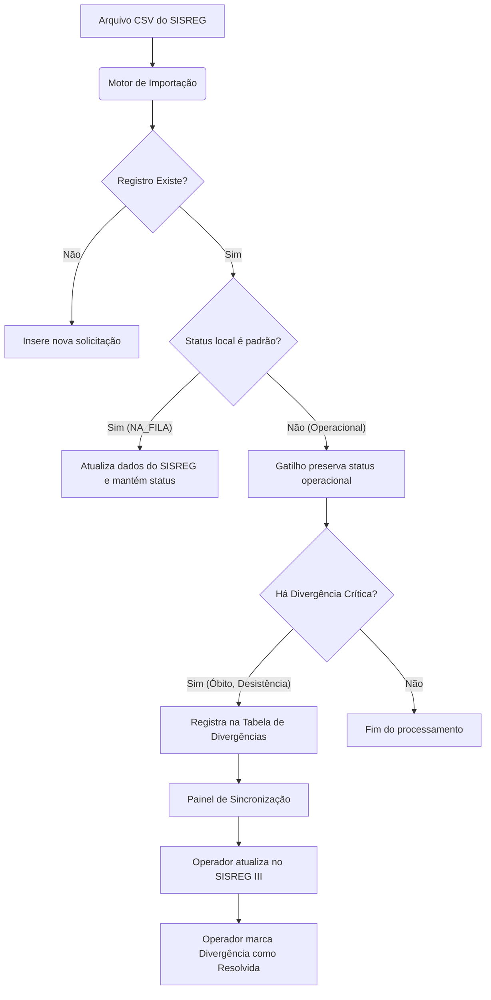

# 🔄 Motor de Sincronização e Gestão de Divergências SISREG

Este documento descreve a especificação técnica e o fluxo operacional do **Motor de Sincronização** e do **Painel de Divergências**, desenvolvido para garantir que o SisFilaSus sirva como a verdade de campo, enquanto auxilia os operadores a sanearem a fila oficial no **SISREG III**.

---

## 🏗️ 1. Arquitetura Geral do Fluxo

A sincronização de dados funciona de forma híbrida:
1. **Atualizações Automáticas (Downstream)**: O SisFilaSus consome dados do SISREG e atualiza o estado local automaticamente quando o SISREG avança (ex: exames agendados ou procedimentos executados).
2. **Alertas Acionáveis (Upstream)**: O SisFilaSus gera tarefas manuais para os operadores cancelarem ou ajustarem solicitações no SISREG que foram atualizadas clinicamente no município (ex: óbitos, desistências).



---

## 🗄️ 2. Estrutura do Banco de Dados

### Tabela: `public.divergencias_sisreg`
Esta tabela rastreia todas as pendências que exigem ação do operador no sistema oficial do SISREG.

```sql
CREATE TABLE public.divergencias_sisreg (
    id UUID PRIMARY KEY DEFAULT gen_random_uuid(),
    cod_solicitacao BIGINT NOT NULL REFERENCES public.fila_solicitacoes(cod_solicitacao) ON DELETE CASCADE,
    importacao_id UUID NOT NULL REFERENCES public.importacoes(id) ON DELETE CASCADE,
    tipo_divergencia VARCHAR(50) NOT NULL CHECK (tipo_divergencia IN (
        'OBITO_ATIVO',           -- Óbito no SisFilaSus, mas ativo no SISREG
        'DESISTENCIA_ATIVA',     -- Desistência no SisFilaSus, mas ativo no SISREG
        'RECUSA_ATIVA',          -- Recusou/Operou particular, mas ativo no SISREG
        'INTERNADO_ATIVO'        -- Internado localmente, mas sem agendamento no SISREG
    )),
    status_sisreg_importado VARCHAR(50),
    status_interno_local VARCHAR(50) NOT NULL,
    resolvido BOOLEAN DEFAULT false NOT NULL,
    resolvido_por UUID REFERENCES public.users(id) ON DELETE SET NULL,
    resolvido_em TIMESTAMP WITH TIME ZONE,
    created_at TIMESTAMP WITH TIME ZONE DEFAULT timezone('utc'::text, now()) NOT NULL,
    updated_at TIMESTAMP WITH TIME ZONE DEFAULT timezone('utc'::text, now()) NOT NULL
);

-- Índices para otimizar a listagem do painel
CREATE INDEX idx_divergencias_resolvido ON public.divergencias_sisreg(resolvido);
CREATE INDEX idx_divergencias_solicitacao ON public.divergencias_sisreg(cod_solicitacao);
```

---

## ⚡ 3. Regras de Preservação de Status (PostgreSQL Trigger)

Para impedir que a importação automática do SISREG sobreponha as atualizações manuais feitas pela equipe de regulação, um trigger `BEFORE UPDATE` bloqueia a sobrescrita do status operacional:

```sql
CREATE OR REPLACE FUNCTION public.preserve_status_interno()
RETURNS trigger AS $$
BEGIN
    -- Se o registro está sendo atualizado
    IF TG_OP = 'UPDATE' THEN
        -- Se o novo status enviado na importação for o padrão inicial (NA_FILA ou CONVOCADO_CONFIRMADO)
        -- Mas o status local atual na base de dados já foi alterado para um estado avançado pelos operadores,
        -- preservamos o status local atual.
        IF (NEW.status_interno IN ('NA_FILA', 'CONVOCADO_CONFIRMADO'))
           AND (OLD.status_interno NOT IN ('NA_FILA', 'CONVOCADO_CONFIRMADO')) THEN
            NEW.status_interno := OLD.status_interno;
        END IF;
    END IF;
    RETURN NEW;
END;
$$ LANGUAGE plpgsql;

CREATE TRIGGER trigger_preserve_status_interno
BEFORE UPDATE ON public.fila_solicitacoes
FOR EACH ROW EXECUTE FUNCTION public.preserve_status_interno();
```

---

## 📥 4. Motor de Detecção de Divergências

Após realizar o lote de inserções e atualizações na tabela `fila_solicitacoes`, o sistema executa uma rotina SQL (ou função de banco) para detectar divergências e popular a tabela `divergencias_sisreg`:

### Queries de Detecção por Tipo:

1. **Óbitos Ativos (`OBITO_ATIVO`)**:
   * *Critério*: Paciente com status interno local `OBITO`, mas a última importação do SISREG ainda o lista com posição na fila ativa.
2. **Desistências Ativas (`DESISTENCIA_ATIVA`)**:
   * *Critério*: Paciente com status interno local `DESISTENCIA` ou `CONVOCADO_RECUSOU`, mas a última importação do SISREG ainda o lista com posição na fila ativa.

```sql
-- Exemplo de inserção em lote pós-importação
INSERT INTO public.divergencias_sisreg (cod_solicitacao, importacao_id, tipo_divergencia, status_sisreg_importado, status_interno_local)
SELECT 
    f.cod_solicitacao,
    f.ultima_importacao_id,
    CASE 
        WHEN f.status_interno = 'OBITO' THEN 'OBITO_ATIVO'::varchar
        WHEN f.status_interno IN ('DESISTENCIA', 'CONVOCADO_RECUSOU') THEN 'DESISTENCIA_ATIVA'::varchar
        ELSE 'OUTRO_CONFLITO'::varchar
    END,
    f.status_sisreg,
    f.status_interno
FROM public.fila_solicitacoes f
WHERE f.ultima_importacao_id = :importLoteId
  AND f.status_interno IN ('OBITO', 'DESISTENCIA', 'CONVOCADO_RECUSOU')
  AND f.posicao_fila IS NOT NULL -- Indica que ainda consta como ativo na fila do SISREG
ON CONFLICT (cod_solicitacao) DO NOTHING;
```

---

## 🖥️ 5. Painel de Controle Operacional (Interface UI)

No menu do SisFilaSus, haverá a rota `/dashboard/sincronizacao` contendo:

1. **Indicador de Pendências**: Cards com contadores de Óbitos Ativos no SISREG, Desistências Ativas e etc.
2. **Tabela de Ação**:
   * Nome do Paciente e CPF/CNS.
   * Procedimento Solicitado.
   * **Divergência detectada** (ex: *Óbito confirmado localmente em 01/06/2026, mas ativo na posição 42º do SISREG*).
   * Botão **`[ Sincronizado no SISREG ]`** que inativa a pendência.

### Benefício para Produção:
* **Escala**: Apenas dados divergentes aparecem na tela (geralmente < 1% da base), mantendo a rotina leve.
* **Transparência**: Relatório serve como lista de trabalho para "limpeza de fila".
